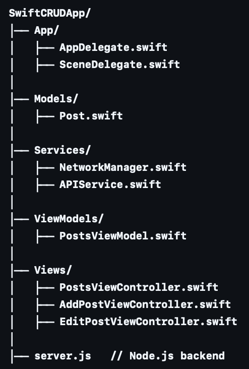

# SwiftCRUDApp

SwiftCRUDApp is a sample iOS project built with **Swift** and **UIKit**, following the **MVVM (Model-View-ViewModel)** architecture with **Delegation** for data binding.  
The app connects to a real **REST API** powered by **Node.js + Express + MongoDB**, supporting full CRUD (Create, Read, Update, Delete) operations.  
You can test the same API both inside the app and via **Postman**.

<p align="center">
  
  
  
</p>

---

## ✨ Features
- **MVVM Architecture** for clean separation of concerns
- **Delegation pattern** for communication between ViewModels and Views
- **Programmatic UIKit** (no Storyboards)
- **Reusable Network Layer** with URLSession and protocol-oriented design
- **CRUD operations** (GET, POST, PUT, DELETE) integrated with backend
- **Postman support** to test REST API endpoints externally

---

## 🛠 Tech Stack
- Swift (UIKit, Programmatic UI)
- MVVM + Delegation
- URLSession (NetworkManager + APIService)
- Node.js + Express (Backend)
- MongoDB (Database)
- Postman (API Testing)

---

## 📂 Project Structure



---

## ⚙️ Setup & Run

### Backend (Node.js + Express + MongoDB)
```bash
cd backend
npm install
node server.js
```
➡️ API will run at: http://127.0.0.1:3000

iOS (Swift App)
	1.	Open SwiftCRUDApp.xcodeproj in Xcode
	2.	Run on simulator (⌘R)
	3.	The app will load posts from the backend
---
# ✍🏻 Postman API Testing
---
## GET – List all posts
GET http://127.0.0.1:3000/posts
---
## POST – Create a new post
POST http://127.0.0.1:3000/posts
Body (raw JSON):
{
  "title": "New Post",
  "body": "Hello World",
  "userId": 1
}
---
## PUT – Update a post
PUT http://127.0.0.1:3000/posts/<id>
Body (raw JSON):
{
  "title": "Updated Title",
  "body": "Updated Content"
}
---
## DELETE – Remove a post
DELETE http://127.0.0.1:3000/posts/<id>
